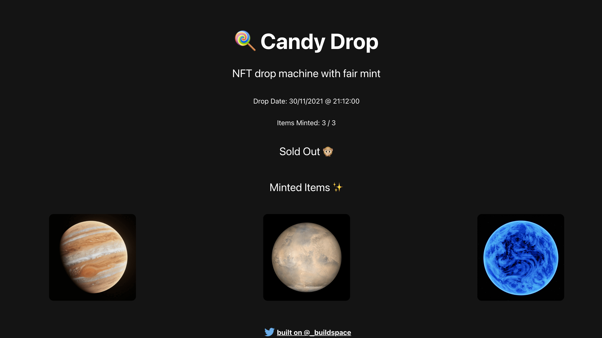

# buildspace Web3 app on Solana with React and Metaplex


[](https://app.netlify.com/sites/anriquez-nft-drop/deploys)




Ship your own custom NFT collection on Solana w/ Metaplex

> Powered by _buildspace
> [Ship your own custom NFT collection on Solana w/ Metaplex in a weekend](https://zip.sc/GTE5v)

## Built With
- Metaplex
- React.js
- HTML5/CSS3, Javascript ES6
- VSCode

## Live Demo @Netlify

[Live Demo Link](https://anriquez-nft-drop.netlify.app/)


## Getting Started

This project was bootstrapped with [Create React App](https://github.com/facebook/create-react-app).

To get a local copy up and running follow these simple example steps.

### Prerequisites

- To install the app in your system, make sure you have node/npm installed. [get npm](https://www.npmjs.com/get-npm)

### Setup

- Clone the repository in your system by using:

`git clone `

## Install

- Next step is to CD into the local repository and run:

`npm install`

### start development mode in your local environment

`npm start`

Runs the app in the development mode.<br />
Open [http://localhost:3000](http://localhost:3000) to view it in the browser.

The page will reload if you make edits.<br />
You will also see any lint errors in the console.

### `npm build`

This command builds the app for production to the `build` folder.<br />
It correctly bundles React in production mode and optimizes the build for the best performance.

The build is minified and the filenames include the hashes.<br />
Your app is ready to be deployed!

See the section about [deployment](https://facebook.github.io/create-react-app/docs/deployment) for more information.

### Environment Variables

Follow the project along and create a ```.env``` file in the ```/app``` folder. Include the following keys. The values will be provided/generated during the project

```
REACT_APP_CANDY_MACHINE_CONFIG= ```<as per project>```
REACT_APP_CANDY_MACHINE_ID=```<as per project>```
REACT_APP_TREASURY_ADDRESS=```<as per project>```
REACT_APP_SOLANA_NETWORK=devnet
REACT_APP_SOLANA_RPC_HOST=https://explorer-api.devnet.solana.com
```

## Authors

👤 **_Carlos Anriquez_**

- Github: [@canriquez](https://github.com/canriquez)
- Twitter: [@cranriquez](https://twitter.com/cranriquez)
- Linkedin: [linkedin](https://www.linkedin.com/in/carlosanriquez/)

## Show your support

Give a ⭐️ if you like this project!


## 📝 License
